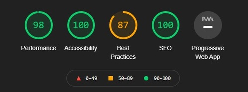

# Halloween in Barrenborough

Halloween in Barrenborough is a website aimed at people from the fictional town of Barrenborough.  
Its primary goal is to set the stage for a good spooky night of trick or treating and fun for all.  
The spooky website, cute informative Halloween videos and 'scary' costume gallery are designed to enthuse children (and adults) for the holiday and encourage them to sign up.  

Families with children can sign up for trick or treating through the sign up form, they can choose between two different routes.  
Everyone living on one of the roads which are part of either route can sign up through a second sign up form to add their address to the map.  

The project was made using only HTML and CSS.  

  

---

## Features

* **Logo**  
The Halloween Logo is styled in the 'Ghastly Panic' font and positioned at the top left of every page.

* **Navigation**  
The navigation menu is positioned at the top right of every page or below the logo on smaller devices.  
It contains the options: 'Home', 'Costume Gallery' and 'Sign Up'.
    * 'Home' leads back to the main page.  
    * 'Costume Gallery' leads to the seperate gallery page.  
    * 'Sign Up' leads to the seperate sign up page, containing both forms.  

    The navigation menu is styled so that the active page-name is shown in a different color.  
     

* **Social Media Footer**  
The social media footer is positioned at the bottom of every page,  
it contains the logos for Facebook, Instagram, Twitter and Youtube.  
Clicking on one of these opens the corresponding website in a new tab.  

* **Color Scheme:**  

---  

* **Header**  
The Header contains a large hero-image of two scary Jack-o-Lanterns which will come forward to haunt you when you touch them with your mouse.  
The purpose of the website is summarized in a small heading in the 'Ghastly Panic' font, placed over the image.  

  

* **Mid Section**  
The Mid-Section of the main page contains short summaries of text and bullets regarding why you should sign up.  
The time, date and which streets will be included on which routes is also indicated.  
A toothy green Jack-o-Lantern adds flair in the center.  

  

* **Video Section**  
The Video section contains three animated youtube videos about Halloween aimed at children.  
'The Origin of Halloween', 'The Origin of Halloween Costumes' and 'The Origin of Jack-O-Lanterns'.  
Below these, the website's footer can be seen.  

  

---  

* **Costume Gallery**  
The Costume Gallery is exactly that, a Photo Gallery of people dressed up for this special Holiday.  

  

---  

* **Sign Up Page**  
The Sign Up page is the page where people can sign up for either 'Trick or Treating', or for their address to be visited on Halloween Night.  
Each form is closed until the person signing up clicks on the one they wish to use,  leaving both forms optional.  
A background of a Pumpkin eating another Pumpkin makes the page more playful.  

 
   

---  

## Testing  

* I tested that this website works in different browsers: Chrome, Microsoft Edge, Safari  

* I confirmed that this project is responsive, looks good and functions on all standard screen sizes using the devtools device toolbar.  

* I confirmed that all written text on the pages is all readable and easy to understand.  

* I have confirmed that both forms work, will only accept an email in the email field and all required fields are made required.  

## Bugs  

**Solved Bugs**  

* The 'trick-or-treat' sign up form input fields would change color when hovering over the 'add-your-home' sign up form.  
While making the forms I had copied the code of the first form, to use in the second form.  
I forgot to change the ID names linking the labels and input fields, changing these IDs fixed the issue.  

* A horizontal scrollbar showed up on the mobile version of the website.  
As I could not find what was causing this overflow, I googled a solution.  
using overflow-x:hidden on both the html and body sections seemed to do the trick.  
The pages now look fine on my phone.  

## Validator Testing  

* HTML  
  * No errors were returned when passing through the official W3C Validator for pages index.html and signup.html.  
   page gallery.html came back with error: 'Warning: Section lacks heading.'    

* CSS
  * No errors were returned when passing through the official W3C Validator.    

 * Accessibility
   * I confirmed that the colors and fonts chosen are easy to read and accessible by running it through Lighthouse in devtools:  
Index.html result:  
  
Gallery.html result:  
  
Signup.html result:  
  

**Unfixed Bugs**  
As the costume gallery is self explanatory and contains only visual elements in the form of photos I deliberately did not add a heading,  
despite this causing an error on the W3C validator for the gallery.html page.  

---  

## Deployment  

* The site was deployed to GitHub Pages. The Steps to deploy are as follows:
  * In the GitHub repository, navigate to the Settings tab.  
  * Scroll down to the GitHub Pages section and click the 'Check it out here!' link.  
  * From the source section drop-down menu, select the Main branch.  
  * Once the Main branch had been selected, the page provided the link to the completed website.  

The live link can be found here: [Halloween in Barrenborough](https://seamse.github.io/ci-project-one/)  

---  

## Credits  

### Content  
* The website's layout inspiration and code for the gallery page was taken from the CI [Love Running](https://seamse.github.io/love-running/) project.  
* Inspiration for the code for the zoom effect on the Hero Image was taken from [Stackoverflow Zoom Effect](https://stackoverflow.com/questions/15757036/creating-a-zoom-effect-on-an-image-on-hover-using-css)  
* The code for the Sign Up forms was taken from [checkbox inspiration](https://stackoverflow.com/questions/31411627/hide-an-input-until-a-checkbox-has-been-checked) & [Responsive forms with Flexbox](https://webdesign.tutsplus.com/tutorials/building-responsive-forms-with-flexbox--cms-26767)  
* The code to fix the horizontal scrollbar on mobile screens was taken from [Stackoverflow Xhidden](https://stackoverflow.com/questions/8635799/overflow-xhidden-still-can-scroll)  
* General flexbox usage inspiration came from [CSS Tricks](https://css-tricks.com/snippets/css/a-guide-to-flexbox/)  
* General code inspiration was taken from [W3Schools](https://www.w3schools.com) & [Stackoverflow](https://www.stackoverflow.com)  
* The Ghastly Panic font was taken from [Sinister Fonts](https://www.sinisterfonts.com)  

### Media  
* All images were taken from [Pexels](https://www.pexels.com/)  
* All videos were taken from [Youtube](https://youtube.com/)  
* The custom HR line was taken from [Seekpng](https://www.seekpng.com/ipng/u2w7a9q8q8e6e6a9_halloween-border-png-for-kids-black-borders-halloween/)  

